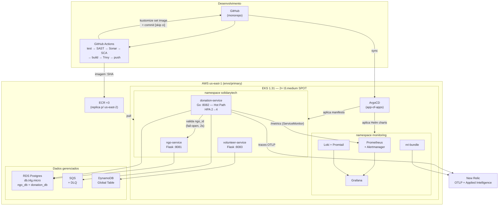
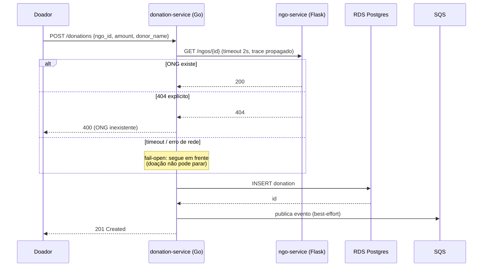
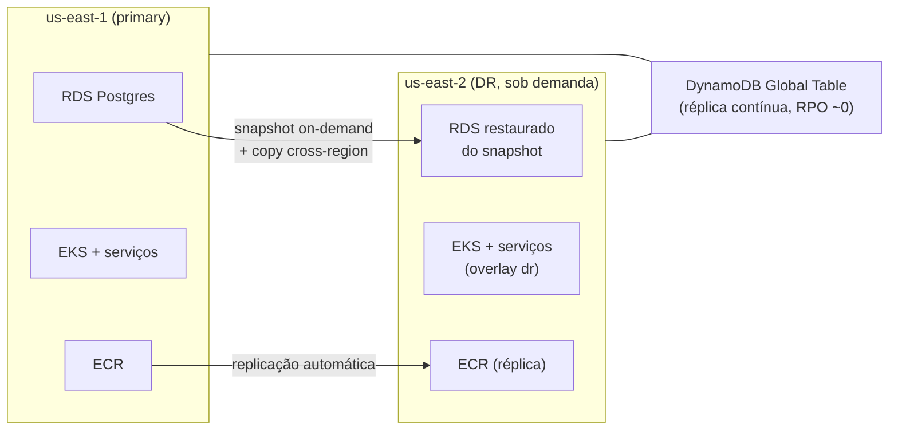

# Arquitetura — SolidaryTech

Visão de arquitetura do ecossistema: o que existe, por que existe assim, e onde
cada coisa está no repositório.

## 1. Visão geral



## 2. Fluxo de uma doação (o Hot Path)



Duas propriedades desse fluxo são decisões, não acidentes:

1. **A validação é fail-open**: se o `ngo-service` estiver fora, a doação é
   registrada mesmo assim (só um `404` explícito rejeita). O objetivo declarado
   pela diretoria — "mesmo que a nuvem falhe, as doações não podem parar" —
   vale também para uma falha interna de dependência.
2. **O evento SQS é publicado *depois* do commit no Postgres**: a doação existe
   antes da notificação. É o que permite dizer, no plano de DR, que perder a
   fila num failover não perde doação (ver [`dr-plan.md`](dr-plan.md)).

E é essa chamada `donation → ngo` que materializa o **distributed tracing**
multi-serviço: o span cliente do Go e o span servidor do Flask compartilham o
trace ID no New Relic.

## 3. Componentes

### Aplicações (`apps/`)

| Serviço | Stack | Porta | Persistência | Papel |
|---|---|---|---|---|
| `ngo-service` | Python 3.12 / Flask + Gunicorn | 8081 | Postgres `ngo_db` | cadastro de ONGs |
| `donation-service` | Go 1.25, `net/http` puro | 8082 | Postgres `donation_db` + SQS | **Hot Path** — alvo dos SLOs |
| `volunteer-service` | Python 3.12 / Flask + Gunicorn | 8083 | DynamoDB | voluntários |

Os três expõem `GET /health` (liveness), `GET /ready` (readiness — testa a
dependência real) e `GET /metrics` (Prometheus). Tracing OTel é condicional:
ativa apenas quando `OTEL_EXPORTER_OTLP_ENDPOINT` está definida.

### Infraestrutura (`infra/terraform/`)

| Diretório | Conteúdo |
|---|---|
| `bootstrap/` | bucket S3 do state (roda 1×, `prevent_destroy`) |
| `modules/network` | VPC 2 AZs, **1 NAT**, endpoints gateway S3/DynamoDB |
| `modules/eks` | EKS 1.31, node group **Spot** 2× t3.medium, addons + EBS CSI (IRSA própria) |
| `modules/rds-postgres` | 1 instância `db.t4g.micro`; restaura de snapshot quando `snapshot_identifier` é passado (é isso que viabiliza o DR) |
| `modules/sqs` | fila de eventos + DLQ (`maxReceiveCount = 5`) |
| `modules/dynamodb` | PAY_PER_REQUEST; Global Table com réplica em `us-east-2` |
| `modules/ecr` | 3 repositórios + replicação cross-region, `force_delete` |
| `modules/irsa` | roles IRSA (donation→SQS, volunteer→DynamoDB) + role OIDC do GitHub Actions |
| `envs/primary` | `us-east-1` — ~90 recursos, aplicado e destruído por ciclo |
| `envs/dr` | `us-east-2` — mesmos módulos, criado sob demanda (~31 recursos) |
| `newrelic/` | alert policies, condições NRQL/baseline, Workflow + e-mail (SaaS, ciclo de vida próprio) |

Tags FinOps (`Project`, `Environment`, `CostCenter`) vêm de `default_tags` do
provider — ver [`finops-forecast.md`](finops-forecast.md).

### GitOps (`gitops/`)

| Diretório | Conteúdo |
|---|---|
| `bootstrap/` | `install.sh` (Helm install do ArgoCD + Application raiz) parametrizado por env |
| `apps/base` | 8 Applications: 3 serviços + kube-prometheus-stack + Loki + Promtail + nri-bundle + platform |
| `apps/overlays/{primary,dr}` | ajusta `path`/registry/IRSA por ambiente |
| `platform/` | ServiceMonitors ×3, PrometheusRules (SLO/burn rate), dashboard Grafana como ConfigMap |
| `workloads/base` | Deployments com probes, requests/limits, ServiceAccounts, HPA no Hot Path |
| `workloads/overlays/{primary,dr}` | imagem + annotation IRSA por ambiente |

### CI/CD (`.github/workflows/`)

Um workflow por serviço, com path filter:

```
test → sast (Semgrep) → sonar (SonarCloud) ┐
                        sca (govulncheck/  ├→ build → scan-image (Trivy) → push (ECR/OIDC) → gitops (bump)
                              pip-audit +  ┘
                              trivy fs)
```

O job `gitops` faz `kustomize edit set image` no overlay `primary` e commita
com `[skip ci]` — é o commit que o ArgoCD detecta para fechar o ciclo de CD.

## 4. Observabilidade

| Sinal | Coleta | Armazenamento | Visualização |
|---|---|---|---|
| Métricas | `/metrics` (client_golang / prometheus-flask-exporter) via ServiceMonitor | Prometheus (retention 2d, PVC 10Gi) | Grafana (dashboard SRE versionado como ConfigMap) |
| Logs | Promtail (DaemonSet) | Loki SingleBinary (48h, PVC 10Gi) | Grafana |
| Traces | OTLP HTTP direto dos apps | New Relic | New Relic (distributed tracing) |
| Infra K8s | `nri-bundle` | New Relic | New Relic |
| Alertas | PrometheusRules → Alertmanager; condições NRQL → Workflow | — | Prometheus UI / e-mail |

Detalhes de SLI/SLO/error budget em [`sre-slo.md`](sre-slo.md); ciclo de
incidentes em [`itsm-incident-flow.md`](itsm-incident-flow.md).

## 5. Disaster Recovery



Warm standby via Terraform modularizado (Opção B do edital), ativado por
`scripts/activate-dr.sh`. **RTO medido no ensaio: 24min23s** (alvo ≤ 1h);
RPO ≤ 1h comprovado com doações reais. Ver [`dr-plan.md`](dr-plan.md).

## 6. Decisões de arquitetura e seus motivos

| Decisão | Alternativa descartada | Motivo |
|---|---|---|
| AWS + EKS | AKS/GKE | o código já usava SQS e DynamoDB |
| Monorepo | 3 repositórios | um pipeline por serviço com path filter dá o mesmo isolamento sem 3× a infraestrutura de repo |
| ArgoCD | FluxCD | UI forte, necessária como evidência em vídeo |
| ArgoCD instalado por Helm, **não** por Terraform | provider `helm` no TF | os finalizers do ArgoCD travam o `terraform destroy` |
| Secrets criados por script a partir de `terraform output` | provider `kubernetes` no TF | evita que o state do TF dependa do cluster (e travar o destroy) |
| 1 Application ArgoCD **por serviço por env** | 1 Application cobrindo os 3 | duas Applications gerenciando o mesmo objeto gera erro de "shared resource" |
| 1 instância RDS com 2 databases | 2 instâncias | metade do custo, isolamento suficiente para o escopo |
| RDS do primary em subnet **pública** (SG restrito ao IP do operador) | subnet privada | o provider `postgresql` roda na máquina de quem aplica; sem rota de entrada ele não alcança a instância nem com `publicly_accessible` |
| Nós Spot | on-demand | −70% no item de EC2; interrupção é aceitável em ambiente efêmero |
| `port-forward` em vez de ALB | Ingress/ALB público | −US$ 20/mês e evita LB órfão travando o `destroy` |
| DR sob demanda | warm standby permanente | −100% do custo ocioso, ao preço de ~25 min de RTO |
| SonarCloud | SonarQube self-hosted | grátis em repo público, sem servidor para manter |

## 7. Limitações conhecidas

- **Infra efêmera**: nada fica de pé entre demos, então dashboards com janela
  de 30 dias mostram apenas o período do ciclo atual (ver a nota de retenção em
  [`sre-slo.md`](sre-slo.md)).
- **Sem malha de serviço / mTLS**: comunicação interna é HTTP simples dentro da
  VPC. Fora de escopo para o hackathon.
- **`activate-dr.sh` depende do state em `us-east-1`**: ponto cego numa falha
  *total* da região primária, documentado em [`dr-plan.md`](dr-plan.md).
- **New Relic pendente**: traces e AIOps estão implementados e prontos, mas
  dependem de uma conta (pendência externa em `CLAUDE.md`).
