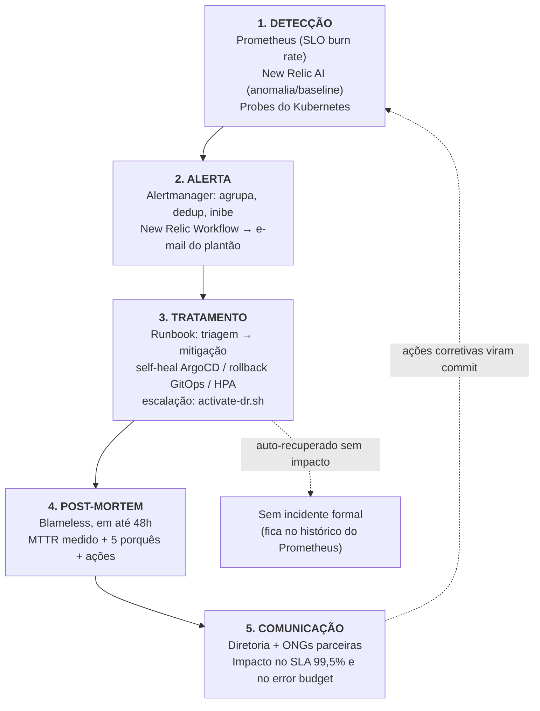

# ITSM + AIOps — Ciclo de vida dos incidentes

Este documento descreve o ciclo completo de um incidente na SolidaryTech —
**Detecção → Alerta → Tratamento → Post-Mortem → Comunicação** — e aponta,
em cada estágio, o artefato que o implementa (não apenas o conceito).



---

## 0. Severidades e o que cada uma exige

| Severidade | Origem típica | Resposta esperada | Notifica? |
|---|---|---|---|
| `critical` | burn rate 14,4×, `TargetDown`, `CrashLoopBackOff` | ação imediata (o error budget está sendo consumido ~20× mais rápido que o sustentável) | sim, imediatamente |
| `warning` | burn rate 6×, p95 > 300ms, anomalia de baseline | investigar no mesmo dia; virar tarefa | sim, agrupado |
| (sem alerta) | pod reiniciado e recuperado pelo probe antes de afetar o SLI | nenhuma — é o sistema se curando | não |

A terceira linha é deliberada. A forma mais
eficaz de reduzir MTTR é fazer com que a maior parte das falhas **nunca se
torne incidente**. Probes `/health`/`/ready` + `selfHeal` do ArgoCD + HPA
resolvem sozinhos a maioria dos modos de falha; o alerta existe para o que
sobra.

---

## 1. Detecção

Três camadas independentes, propositalmente redundantes — uma detecta o que a
outra não vê:

| Camada | O que detecta | Latência de detecção | Implementação |
|---|---|---|---|
| **Prometheus / SLO** | violação **do contrato** (error budget queimando, p95 acima de 300ms) | 2–7 min (janela de 5m + `for: 2m`) | `gitops/platform/prometheusrules/donation-service-slo.yaml` |
| **New Relic Applied Intelligence** | **desvio do normal** antes de virar violação de SLO (queda de throughput, latência fora do padrão aprendido) | 1–5 min | `infra/terraform/newrelic/main.tf` (condições `baseline`) |
| **Kubernetes** | pod morto, container em CrashLoop, dependência inacessível | segundos | probes em `gitops/workloads/base/*/deployment.yaml` |

### Sinais monitorados

| Sinal | Alerta (Prometheus) | Condição equivalente (New Relic) |
|---|---|---|
| Erro 5xx queimando o budget rápido | `DonationServiceErrorBudgetBurnRateCritical` | `donation-service: taxa de erro em POST /donations` (crítico 1,44%) |
| Erro 5xx queimando o budget devagar | `DonationServiceErrorBudgetBurnRateWarning` | idem (warning 0,6%) |
| Latência p95 > 300ms | `DonationServiceHighLatencyP95` | `donation-service: latencia p95 em POST /donations` |
| Latência fora do padrão (sem estourar o SLO) | — | `donation-service: anomalia de latencia (baseline)` |
| Doações pararam de chegar / pico anormal | — | `donation-service: anomalia de throughput (baseline)` |
| Pod reiniciando em loop | `SolidaryTechPodCrashLooping` | `solidarytech: containers reiniciando (CrashLoop)` |
| Serviço não responde ao scrape | `SolidaryTechTargetDown` | (coberto pela anomalia de throughput) |

As duas linhas que só existem no New Relic são exatamente a parte **preditiva**
exigida pelo edital: um alerta de burn rate só dispara depois de haver erro; um
baseline dispara quando o comportamento *muda*, mesmo sem erro nenhum.

> **Detalhe de arquitetura que muda o diagnóstico**: a validação
> `donation → ngo` é **fail-open** (`apps/donation-service/main.go`, timeout de
> 2s — só rejeita em 404 explícito). Consequência prática: se o `ngo-service`
> cair, o Hot Path **não** passa a devolver 5xx — ele fica ~2s mais lento por
> requisição. Ou seja, essa falha aparece primeiro como **incidente de
> latência** (`DonationServiceHighLatencyP95` / anomalia de latência), não de
> disponibilidade. Quem for triar sem saber disso vai procurar erro no lugar
> errado. Foi uma escolha de projeto: proteger a doação (a doação é gravada
> mesmo com o `ngo-service` fora) e pagar em latência.

### AIOps — habilitando o New Relic

```bash
# Credenciais (nunca versionadas):
export NEW_RELIC_ACCOUNT_ID=<Administration -> Access management -> Accounts>
export NEW_RELIC_API_KEY=NRAK-...   # User key; NÃO é a license key dos apps
export NEW_RELIC_REGION=US

cd infra/terraform/newrelic
cp backend.hcl.example backend.hcl   # mesmo bucket de state do bootstrap
terraform init -backend-config=backend.hcl
terraform apply -var 'alert_emails=["plantao@exemplo.com"]'
```

O que isso cria (tudo como código — o edital proíbe configuração pelo console):
2 alert policies, 3 condições estáticas, **2 condições `baseline` (a "IA
habilitada": limiar aprendido, não fixo)**, 1 destination de e-mail, 1 channel
e 1 Workflow com enrichment NRQL.

Além das condições baseline, a detecção de anomalias automática do New Relic
(**Applied Intelligence → proactive detection / anomaly detection**) atua sobre
os serviços que reportam via OTLP sem nenhuma configuração adicional; ela vem
ativa por padrão na conta e **não é exposta pelo provider Terraform** (não
existe recurso equivalente — verificado na v3.95 do provider). Conferência na
UI: *Alerts → AIOps → Anomaly detection* (deve estar `Enabled`) e
*Alerts → Issues & activity*, onde as anomalias aparecem correlacionadas aos
issues abertos pelas condições acima.

Os dados chegam ao New Relic por duas vias já implementadas na Fase 5:
- **Traces/spans OTLP** direto dos 3 serviços (`OTEL_EXPORTER_OTLP_ENDPOINT`
  nos Secrets criados por `scripts/deploy-primary.sh` quando
  `NEW_RELIC_LICENSE_KEY` está definida) — é isso que alimenta as NRQL de
  `Span` e o **distributed tracing** `donation → ngo`.
- **Infraestrutura Kubernetes** via `nri-bundle`
  (`gitops/apps/base/nri-bundle-app.yaml`) — alimenta `K8sContainerSample`.

> **Status**: aplicado na conta 8324859. Foram criadas 2 alert policies e 5
> condições (3 estáticas + 2 baseline), e o tracing distribuído `donation → ngo`
> está confirmado. O único recurso que não pôde ser criado é o
> `newrelic_workflow` — o roteamento automático do alerta para e-mail: a API
> responde `MISSING_ENTITLEMENT` no plano gratuito, mesmo com a conta já
> ingerindo dados. É limitação de plano, não de implementação.

---

## 2. Alerta

### Alertmanager — agregação, deduplicação e inibição

Configurado em `gitops/apps/base/kube-prometheus-stack-app.yaml`
(`alertmanager.config`):

| Regra | Valor | Por quê |
|---|---|---|
| `group_by` | `alertname`, `severity`, `service` | um deploy ruim que derruba as 2 réplicas do `donation-service` é **um** incidente, não dois |
| `group_wait` | 30s (10s para `critical`) | dá tempo de agrupar alertas correlacionados sem atrasar o crítico |
| `repeat_interval` | 4h | reenvia enquanto não resolvido, sem inundar |
| `inhibit_rules` | `critical` inibe `warning` do mesmo `service` | o burn rate de 6× dispara pelo mesmo sintoma do de 14,4×; notificar os dois é ruído sobre um incidente já conhecido |
| rota do `Watchdog` | receiver `null` | o `Watchdog` do chart dispara sempre (prova de que o pipeline de alertas está vivo) e nunca deve notificar |

Validação desta configuração (feita com o `amtool` oficial, sem precisar de
cluster):

```bash
kubectl kustomize gitops/apps/overlays/primary > /tmp/apps.yaml
# extrair o bloco alertmanager.config para /tmp/alertmanager.yml e:
docker run --rm --entrypoint amtool -v /tmp:/w prom/alertmanager:latest \
  check-config /w/alertmanager.yml
docker run --rm --entrypoint amtool -v /tmp:/w prom/alertmanager:latest \
  config routes test --config.file=/w/alertmanager.yml alertname=Watchdog
```

Resultado obtido: `SUCCESS — 1 inhibit rules, 2 receivers`; o roteamento
devolve `null` para o `Watchdog` e `plantao` para os alertas de severidade.

### Entrega ao plantão

A notificação por e-mail sai pelo **Workflow do New Relic**
(`newrelic_workflow` em `infra/terraform/newrelic/main.tf`), com
`notification_triggers = [ACTIVATED, ACKNOWLEDGED, CLOSED]`. Motivos da
escolha:

- O e-mail já chega **enriquecido**: o `enrichments` do Workflow executa uma
  NRQL (`count` de 5xx nos últimos 30 min) e injeta o resultado na
  notificação — quem recebe já sabe o tamanho do problema antes de abrir
  qualquer UI.
- `ACTIVATED` e `CLOSED` delimitam o MTTR: a diferença entre os dois e-mails
  **é** o tempo de recuperação registrado no post-mortem.
- Não exige credenciais SMTP versionadas no repositório (o receiver `plantao`
  do Alertmanager existe justamente como ponto de extensão, caso se queira
  notificar direto do cluster).

O Alertmanager continua sendo a camada de **silenciamento** durante manutenção
programada:

```bash
kubectl -n monitoring port-forward svc/kube-prometheus-stack-alertmanager 9093:9093
# UI em http://localhost:9093 → Silences → New Silence
```

---

## 3. Tratamento

### Triagem (primeiros 60 segundos)

```bash
# 1) O que está gritando?
kubectl -n monitoring port-forward svc/kube-prometheus-stack-prometheus 9090:9090
# → http://localhost:9090/alerts

# 2) Qual o estado real da plataforma?
kubectl -n argocd get applications
kubectl -n solidarytech get pods,hpa
kubectl -n solidarytech get events --sort-by=.lastTimestamp | tail -20

# 3) O impacto no contrato (SLO):
#    Dashboard "SolidaryTech - SRE Golden Metrics & SLO" no Grafana
kubectl -n monitoring port-forward svc/kube-prometheus-stack-grafana 3000:80
```

### Árvore de decisão

| Sintoma | Causa provável | Mitigação | Onde |
|---|---|---|---|
| `SolidaryTechPodCrashLooping` após um deploy | imagem nova quebrada | **rollback GitOps**: `git revert` do commit de bump de imagem → ArgoCD sincroniza | `gitops/workloads/overlays/primary/<serviço>` |
| Pod `Running` mas `/ready` falhando | dependência (RDS/DynamoDB) inacessível | conferir SG/credenciais; o retry com backoff dos 3 serviços já cobre indisponibilidade transitória | `apps/*/` (Fase 1) |
| Manifesto divergente do Git (alguém rodou `kubectl edit`) | drift | nenhuma ação: `selfHeal: true` do ArgoCD reverte sozinho | `gitops/apps/base/*-app.yaml` |
| p95 alto **sem** aumento de 5xx | `ngo-service` degradado/fora (fail-open, ver nota na seção 1) | `kubectl -n solidarytech get pods -l app.kubernetes.io/name=ngo-service`; restaurar réplicas | — |
| Latência sobe junto com o tráfego | saturação de CPU do Hot Path | o HPA escala 2→4 réplicas sozinho; se saturar em 4, revisar `limits` | `gitops/workloads/base/donation-service/hpa.yaml` |
| `TargetDown` nos 3 serviços ao mesmo tempo | problema de nó/cluster | `kubectl get nodes`; nó Spot recuperado pode ter sido reciclado | `modules/eks` |
| Região inteira degradada | falha de zona/região AWS | **escalar para DR**: `./scripts/activate-dr.sh` (RTO medido: 24min23s) | [`dr-plan.md`](dr-plan.md) |

### Princípio

A ordem de tentativa é sempre: **deixar a automação agir → reverter via Git →
intervir manualmente**. Intervenção manual com `kubectl` é a última opção — e
não só por disciplina de GitOps: qualquer mudança manual será desfeita pelo
`selfHeal` do ArgoCD em segundos, o que na prática *aumenta* o MTTR de quem
tenta esse caminho.

### MTTR — como é medido

MTTR = (instante em que o sinal volta ao normal no dashboard) − (instante do
primeiro impacto no SLI). Os dois instantes são lidos do mesmo lugar
(dashboard Grafana / issue do New Relic), justamente para não medir "tempo até
alguém perceber" em vez de "tempo até o usuário parar de sofrer".

Meta: **MTTR < 5 min** para os modos de falha auto-recuperáveis (a maioria).
O roteiro cronometrado da demonstração está em
[`sre-slo.md`](sre-slo.md#demo-de-mttr-roteiro), e o post-mortem do incidente
injetado nessa demo é [`postmortem-mttr-demo.md`](postmortem-mttr-demo.md).

---

## 4. Post-Mortem

Regras adotadas:

1. **Blameless**: o objeto de análise é o sistema, não a pessoa. Se a ação de
   uma pessoa causou o incidente, a pergunta é por que o sistema permitiu.
2. **Obrigatório** para todo incidente `critical` e para qualquer consumo de
   error budget acima de 10% (≥ 4,3 min de indisponibilidade), independente de
   severidade.
3. **Prazo de 48h** — com o incidente fresco e as métricas ainda dentro da
   retenção de 2 dias do Prometheus (limitação real deste ambiente: passado
   esse prazo, o dado que sustenta a análise não existe mais).
4. Toda ação corretiva vira **item rastreável** (issue/commit), com dono. Um
   post-mortem sem commit associado não fechou nada.

Template: [`postmortem-template.md`](postmortem-template.md).
Post-mortem do incidente da demo de MTTR:
[`postmortem-mttr-demo.md`](postmortem-mttr-demo.md).

---

## 5. Comunicação aos stakeholders

### Quem recebe o quê

| Público | Quando | Canal | Conteúdo |
|---|---|---|---|
| Plantão técnico | no disparo | e-mail (Workflow New Relic) + Alertmanager | alerta cru + enrichment + runbook |
| Diretoria da SolidaryTech | incidente `critical` > 15 min | e-mail | impacto em doações, previsão, sem jargão |
| ONGs parceiras | quando o **SLA de 99,5%** é ameaçado | e-mail | impacto, o que foi feito, o que muda para elas |
| Todos | até 48h após | post-mortem publicado no repositório | causa raiz e ações |

O gatilho da comunicação externa é contratual, não sentimental: o SLA com as
ONGs é 99,5%/30d (216 min de budget), enquanto o SLO interno é 99,9% (43,2
min). Enquanto o consumo estiver dentro do budget **interno**, é problema de
engenharia; quando passa dele, a folga que resta antes de furar o contrato
começa a ser consumida — e aí é assunto de negócio. Ver
[`sre-slo.md`](sre-slo.md).

### Modelo — comunicado inicial (durante o incidente)

> **Assunto**: [SolidaryTech] Instabilidade no processamento de doações — em andamento
>
> Prezados,
>
> Identificamos às **HH:MM (BRT)** uma instabilidade que afeta o
> processamento de doações na plataforma SolidaryTech.
>
> - **Impacto**: <ex.: parte das doações está levando mais de 2s para ser
>   confirmada / doações não estão sendo confirmadas>.
> - **Escopo**: <serviço/ambiente afetado>. Os dados já registrados **não**
>   foram afetados.
> - **Ação em curso**: nossa equipe está atuando conforme o plano de resposta
>   a incidentes; a automação de recuperação foi acionada às HH:MM.
> - **Próxima atualização**: em até 30 minutos, ou antes se houver
>   normalização.
>
> Equipe de Plataforma — SolidaryTech

### Modelo — resolução

> **Assunto**: [SolidaryTech] Resolvido — instabilidade no processamento de doações
>
> Prezados,
>
> A instabilidade reportada às HH:MM foi **resolvida às HH:MM**
> (duração: **MM min**).
>
> - **Causa**: <uma frase, sem jargão>.
> - **Impacto final**: <N doações afetadas / nenhuma doação perdida>.
> - **Consumo do orçamento de confiabilidade**: MM min dos 43,2 min mensais
>   (**XX%**). O SLA de 99,5% acordado **não** foi violado.
> - **Prevenção**: <ação corretiva + prazo>. O relatório completo
>   (post-mortem) será publicado em até 48h.
>
> Agradecemos a compreensão e seguimos à disposição.
>
> Equipe de Plataforma — SolidaryTech

### Modelo — comunicado de failover regional (DR)

> **Assunto**: [SolidaryTech] Operação transferida para região de contingência
>
> Prezados,
>
> Devido a uma indisponibilidade na região primária do nosso provedor de
> nuvem, a plataforma foi transferida para o ambiente de contingência às
> **HH:MM**, conforme nosso Plano de Continuidade de Negócios.
>
> - **Tempo de recuperação (RTO)**: MM min (alvo contratado: até 1 hora).
> - **Perda de dados (RPO)**: nenhuma doação registrada foi perdida.
>   Notificações assíncronas em trânsito no instante da transferência podem
>   não ter sido enviadas.
> - **O que muda para vocês**: nada nas integrações; endereços e credenciais
>   permanecem os mesmos.
>
> Detalhes técnicos: `docs/dr-plan.md`.
>
> Equipe de Plataforma — SolidaryTech

---

## Referências

- SLIs/SLOs/SLA e error budget: [`sre-slo.md`](sre-slo.md)
- Alertas (código): `gitops/platform/prometheusrules/donation-service-slo.yaml`
- Alertas/AIOps New Relic (código): `infra/terraform/newrelic/`
- Continuidade de negócios: [`dr-plan.md`](dr-plan.md)
- Custos e tags: [`finops-forecast.md`](finops-forecast.md)
